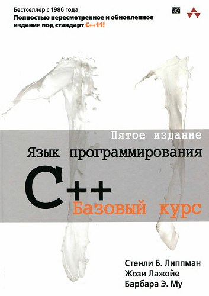

## Чему посвящены заметки

Здесь собраны конспект книги по C++, рекомендованной Д.В. Полевым на первой лекции

А также информация из лекций Полевого и полезных интернет источников типа [этого](https://metanit.com/cpp/tutorial/)

## Как пользоваться заметками
У каждого вопроса есть свой номер.
Выберите вопрос из списка, который хотите заботать, и откройте файл с соответствующим номером