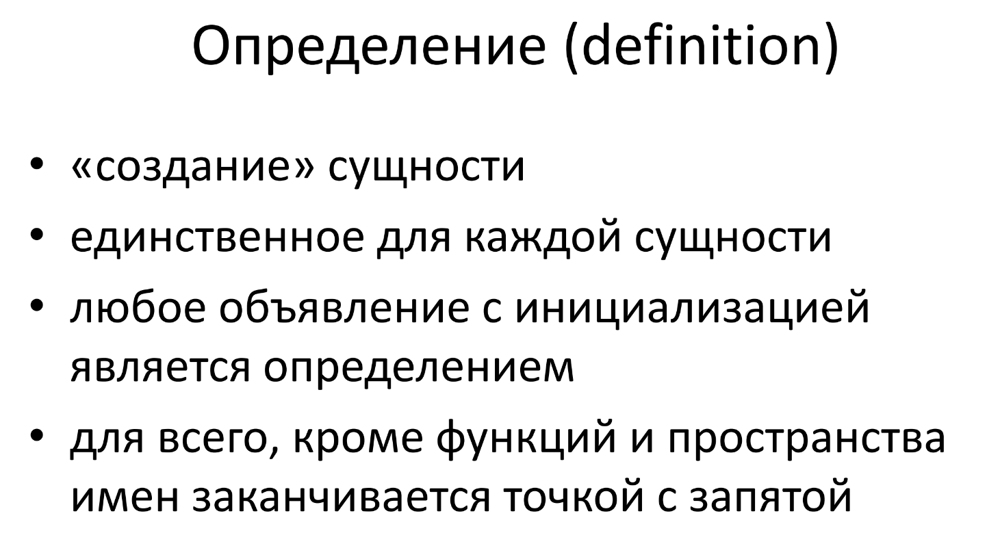

# Определение



## Опредедление переменных
Простое определение переменной состоит из спецификатора типа
(type specifier), сопровождаемого списком из одного или нескольких имен
переменных, отделенных запятыми, и завершающей точки с запятой. Тип
каждого имени в списке задан спецификатором типа. 

```cpp
int a, b; //обпределили переменные a и b типа int

int c, d = 5; //опредеили и инициализировали переменные c и d типа int значением 5
```

## Определение функций

Формальное определение функции выглядит следующим образом:

```cpp
тип имя_функции(параметры);
{
    инструкции
}

int function(a,b)
{
    a = a + b
}
```
Первая строка представляет заголовок функции. Вначале указывается возвращаемый тип функции. Если функция не возвращает никакого значения, то используется тип **void**.