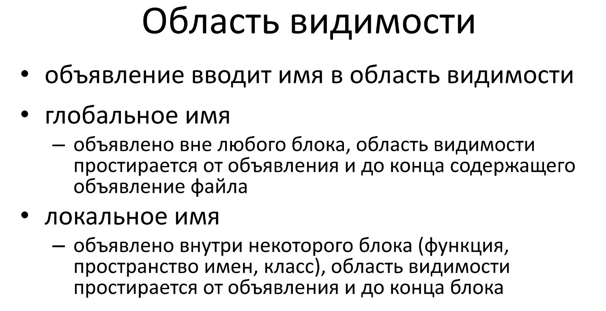

# Область видимости

Область видимости (scope) — это часть программы, в которой у имени
есть конкретное значение. Как правило, области видимости в языке С++
разграничиваются фигурными скобками.



Как правило, область видимости ограничивается блоком кода, который заключается в фигурные скобки. В зависимости от области видимости создаваемые объекты могут быть глобальными, локальными или автоматическими.

Об этом подробнее в файле q_38.md

Рассмотри этот код. Назовём его Программа_1
```cpp
#include <iostream>
int main() {
    int sum = 0;
        for (int val = 1; val <= 10; ++val)
            sum += val; // эквивалентно sum = sum + val
    std::cout << "Sum of 1 to 10 inclusive is " << sum << std::endl;
return 0;
}
```
Эта программа определяет три имени — **main**, **sum** и **val**, а также
использует имя пространства имен **std**, наряду с двумя именами из этого
пространства имен — **cout** и **endl**. Подробнее об пространстве имён говорится в q_116.md.

Имя main определено вне фигурных скобок. Оно, как и большинство
имен, определенных вне функции, имеет *глобальную область видимости*
(global scope). Будучи объявлены, имена в глобальной области видимости
доступны в программе повсюду. Имя sum определено в пределах блока,
которым является тело функции main(). Оно доступно от момента
объявления и далее в остальной части функции main(), но не за ее
пределами. Переменная sum имеет *область видимости блока* (block scope).
Имя val определяется в пределах оператора for. Оно применимо только в
этом операторе, но не в другом месте функции main().

Области видимости могут содержать другие области видимости.
Содержащаяся (или вложенная) область видимости называется *внутренней
областью видимости* (inner scope), а содержащая ее области видимости —
*внешней областью видимости* (outer scope).
Как только имя объявлено в области видимости, оно становится
доступно во вложенных в нее областях видимости. Имена, объявленные во
внешней области видимости, могут быть также переопределены во
внутренней области видимости:
