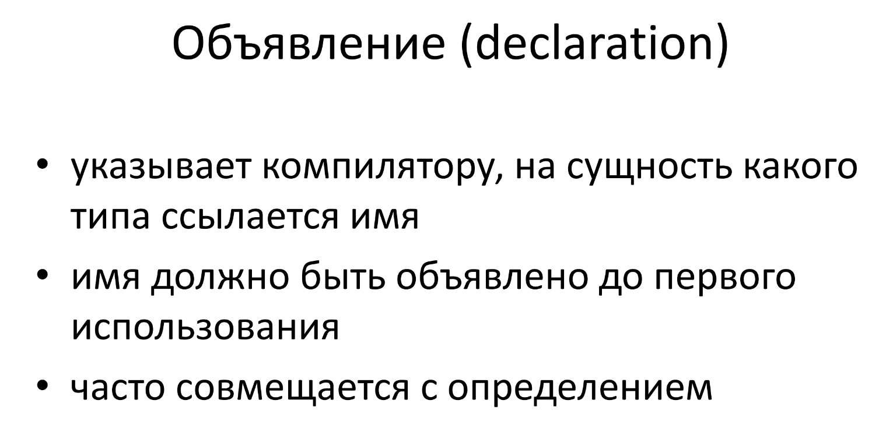

# Объявление



Важно разделять объявление и определение (про которое можно почитать в файле q_102.md)

**Объявление** (declaration) делает имя известным
программе. **Определение**
(definition) создает соответствующую сущность.

**Объявлены переменные могут быть много раз, но определены только
однажды.**

## Объявление переменных 

Объявление переменной определяет ее тип и имя. Определение переменной — это ее объявление. Кроме задания имени и типа, определение резервирует также место для ее хранения и может снабдить переменную исходным значением.
Чтобы получить объявление, не являющееся также определением, добавляется ключевое слово *extern* и можно не предоставлять явный инициализатор.

```cpp
extern int i; // объявить, но не определить переменную i
int j; // объявить и определить переменную j
```

Любое объявление, которое включает явный инициализатор, является
определением. Для переменной, определенной как extern (внешняя),
можно предоставить инициализатор, но это отменит ее определение как
extern. Объявление внешней переменной с инициализатором является ее
определением:
```cpp
extern double pi = 3.14; // определение
```

## Объявление функций

Объявление функции это, фактически, её заголовок.

Выглядит вот так:

```cpp
тип имя_функции(параметры);

int function(a);
void function2();
```
Простой пример: когда мы пишем библиотеку, то в cpp файле мы определяем функции, а в hpp записываем только их объявления.
